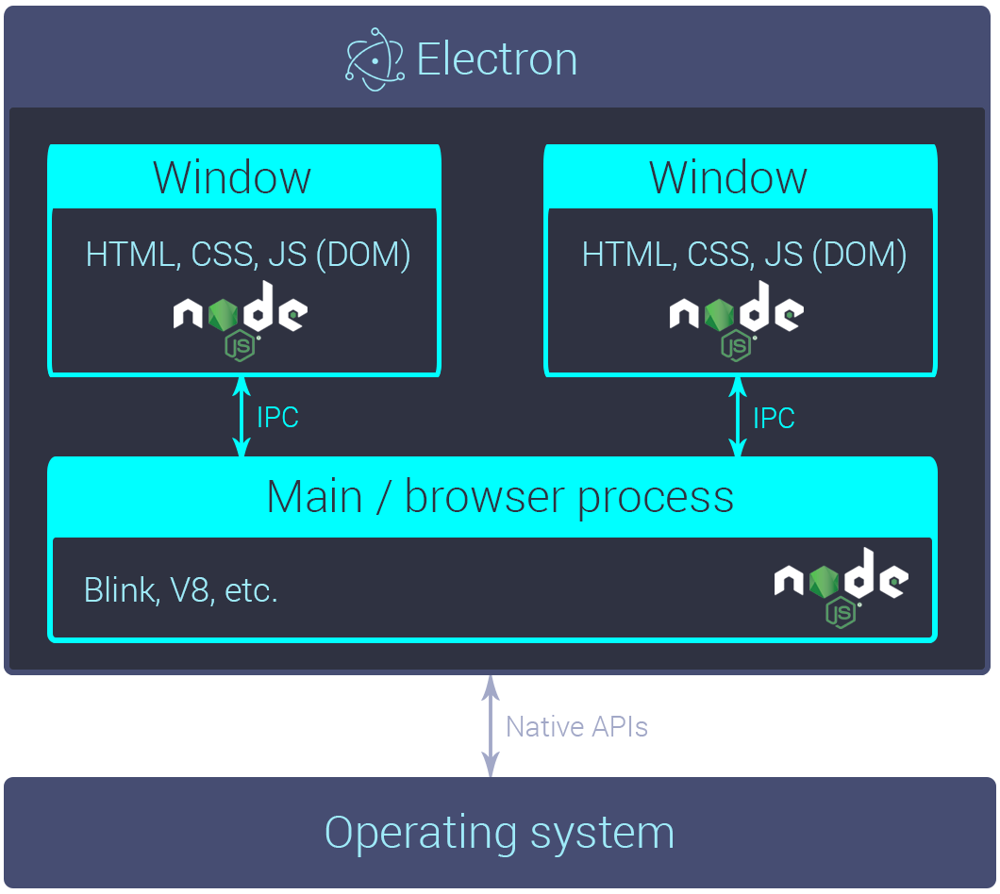

# 1. Electron

Electron은 framework이다.

Electron is a framework for creating native applications with web technologies like JavaScript, HTML, and CSS.

## Framework VS Library

라이브러리는 앱을 풍성하게 하기 위한 도움 요소입니다.
- Electron + React
- Electron + jQuery

제어하는 부분이 다르다면 프레임워크를 한가지만 써야 하는것은 아닙니다.
- Electron + Angular

> Electron 은 `Web Technologies` 을 통해 Native Desktop App
을 만드는 Framework 입니다.

## Web Technologies 란?

HTML, CSS, JavaScript 로 하는 모든 것 입니다.  
`어떻게 하면 일렉트론을 잘 만들수 있어요?  `
- `일렉트론 프레임워크에 대한 이해 (구조 및 API)`  
- HTML, CSS, JavaScript  

## 일렉트론 프레임워크의 이해

### Node.js & chrome

일렉트론은 이 두가지를 이용합니다.  
Node.js 와 OS 의 이벤트 루프를 합쳐 ' Native UI ' 를 제어합니다.  
- Native UI ?  
- 어떤 노드를 쓰나요?  
  - 노드 버전은 일렉트론 버전과 함께 올라갑니다.  
  - 사용할 수 있는 자바스크립트 문법이나 노드 api 가 달라집니다.  

크롬 브라우저에 들어가는 크로미움을 개조한 라이브러리를 랜더링 할때 사용합니다.  
- 크롬의 버전 체크가 중요합니다.

[Electron](https://electron.atom.io/)  

GPU를 사용하는 이유 canvas, css의 GPU가속을 사용할때 사용한다.

## Electron 전체 구조

## Main Process & Renderer Process (3)
Main Process - Only One  
- 그냥 노드 서버라고 생각하면 편하다  

Renderer Process - 만들기 나름  
- 크롬 브라우저라고 생각하면 편하다.  
- 크롬에서 노드를 사용할 수 있다.
  - 브라우저 샌드박스가 아니다.  
  - 하지만 샌드박스로 만들수 있다.  
- BrowserWindow 객체를 생성하면 rendrer-process가 생긴다.  

`main process에서 new로 instance를 만들면 rendrer-process가 생성된다.`

GPU Process - Default  
  - 사용하지 않을 수 있다.  

## ipc & remote

Main 과 Renderer 프로세스는 각각 별도의 프로세스이다.  
- 데이타를 주고 받으려면 별도의 방식을 사용해야 한다.

방식 1. IPC - Inter Process Communication(동기방식)  
- 메인의 ipcMain 모듈과 랜더러의 ipcRenderer 모듈을 이용  
- 이벤트를 반인딩하고, 메세지와 데이터를 샌드하는 방식  

방식 2. remote(remote는 main을 나타낸다.)
- rendrer-process의 remote 모듈을 이용  
- 메인의 몇가지 모듈을 제어 가능하다.  
- 라이프사이클로 인해 사용에 주의한다.  
  - 주로 단발성 액션에 사용  

> 주의 사항 rendrer-process는 사라질 가능성이 있으니 조심해서 사용해야한다.

## Discuss. 왜 메인으로 보내야 할까요 ?
